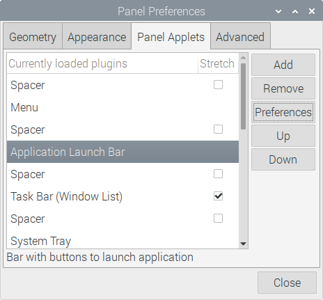
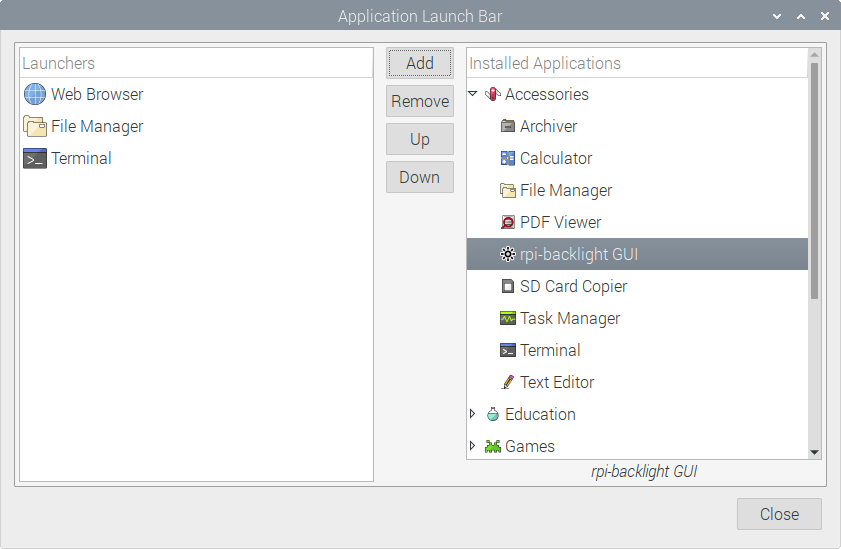

# rpi-backlight

[](https://travis-ci.org/linusg/rpi-backlight) [](https://github.com/linusg/rpi-backlight/issues) [](ttps://github.com/linusg/rpi-backlight/blob/master/LICENSE) [](https://github.com/ambv/black) [](https://pypi.org/project/rpi_backlight/) [](https://rpi-backlight.readthedocs.io/en/latest/)

> A Python module for controlling power and brightness of the official Raspberry Pi 7" touch display.


**Note:** _Since creation of this GIF, the API, specifically the default parameters of the `set_brightness` function, has changed a little bit, so please don't try to use it as the API reference 🙂_

## Version 2 coming!

Please note that version 2 with a new, improved API will come soon, see [issue #14](https://github.com/linusg/rpi-backlight/issues/14). Feedback is much appreciated!

## Features

- Change the display brightness **smoothly** or **abrupt**
- Set the display power on or off
- Get the current brightness
- Get the maximum brightness
- Get the display power state (on/off)
- Command line interface
- Graphical user interface

## Requirements

- A **Raspberry Pi** including a correctly assembled **7" touch display v1.1 or higher** running a Linux-based OS
- Python 2.7 or 3.4+
- Optional: `pygobject` for the GUI, is likely to be already installed on a recent Raspbian

## Installation

- Install from PyPI:

  ```console
  $ pip3 install rpi_backlight
  ```

- or clone this repository and install manually:

  ```console
  $ git clone https://github.com/linusg/rpi-backlight.git
  $ cd rpi-backlight
  $ sudo python3 setup.py install
  ```

**Note:** You may need to change the backlight rules file in order to run the code:

```console
$ echo 'SUBSYSTEM=="backlight",RUN+="/bin/chmod 666 /sys/class/backlight/%k/brightness /sys/class/backlight/%k/bl_power"' | sudo tee -a /etc/udev/rules.d/backlight-permissions.rules
```

## Usage

### API

Example in a Python shell:

```python
>>> import rpi_backlight as bl
>>> bl.set_brightness(255)
>>> bl.set_brightness(20, smooth=True, duration=3)
>>> bl.get_max_brightness()
255
>>> bl.get_actual_brightness()
20
>>> bl.get_power()
True
>>> bl.set_power(False)
```

**NOTE: Code using `set_` functions of this library has to be run as root, e.g. `sudo python3 file.py`, if the permissions for changing the backlight were not changed as described in the installation section!**

### CLI

Open a terminal and run `rpi-backlight` as root:

```console
$ rpi-backlight -b 255
$ rpi-backlight -b 20 -s -d 3
$ rpi-backlight --max-brightness
255
$ rpi-backlight --actual-brightness
20
$ rpi-backlight --power
True
$ rpi-backlight --off
```

### GUI

Open a terminal and run `rpi-backlight-gui` as root.


### Adding a shortcut to the LXDE panel

First, create a `.desktop` file for rpi-backlight (e.g. `/home/pi/.local/share/applications/rpi-backlight.desktop`) with the following content:

```
[Desktop Entry]
Version=1.0
Type=Application
Terminal=false
Name=rpi-backlight GUI
Exec=/home/pi/.local/bin/rpi-backlight-gui
Icon=/usr/share/icons/HighContrast/256x256/status/display-brightness.png
Categories=Utility;
```

_The absolute path to `rpi-backlight-gui` might differ if you did not follow the installation instructions above, e.g. installed as root._

Make it executable:

```console
$ chmod +x /home/pi/.local/share/applications/rpi-backlight.desktop
```

You should now be able to start the rpi-backlight GUI from the menu: `(Raspberry pi Logo) → Accessoires → rpi-backlight GUI`.

Next, right-click on the panel and choose `Add / Remove panel items`. Select `Application Launch Bar` and click `Preferences`:



Select `rpi-backlight GUI` on the right and click `Add`:



You're done! The result should look like this:


## Todo

Yay, this list is currently empty! Feel free to add ideas here.

## External Links

- [Travis CI: Build tests](https://travis-ci.org/linusg/rpi-backlight)
- [readthedocs.org: Documentation](https://rpi-backlight.readthedocs.io/en/latest/)

## License

The source code and all other files in this repository are licensed under the MIT license, so you can easily use it in your own projects. See [`LICENSE`](LICENSE) for more information.
